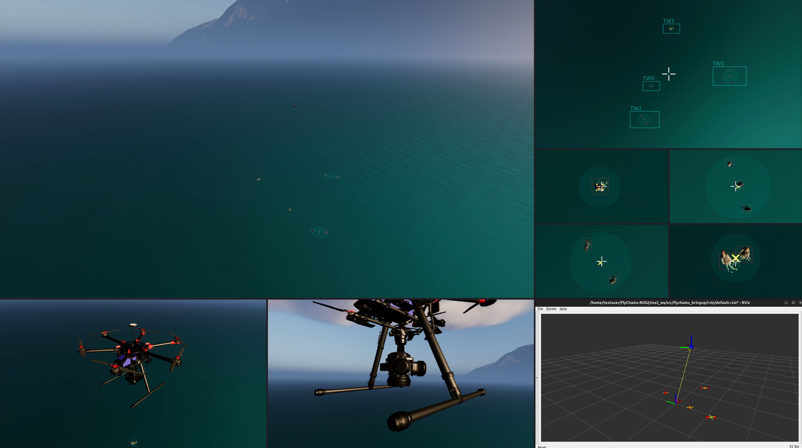

# Flying Chameleons ROS2: Multi-UAV System for Autonomous Target Tracking

[](https://docs.ros.org/en/humble/)
[](https://www.unrealengine.com/)
[](https://microsoft.github.io/AirSim/)
[](https://px4.io/)
[](https://creativecommons.org/licenses/by-nc/4.0/)

A ROS2-based system for coordinated multi-UAV target tracking using various advanced simulation frameworks (e.g. AirSim, Unreal Engine 5, etc.).

## Overview

The Flying Chameleons (FlyChams) project implements a complete system for controlling and coordinating multiple UAVs equipped with modifiable tracking systems. The primary goal is to optimize target tracking through collaborative agent positioning and camera control.

The project leverages:
- **Unreal Engine 5** for photorealistic simulation
- **AirSim** for high-fidelity physics simulation
- **PX4** for commercial flight control
- **ROS2** for the distributed robotics framework

---

<div align="center">
  
  <p><em>Complete simulation view showing the UE5 environment, operator GUI, and real-time RViZ data.</em></p>
</div>

## Key Features

- Multi-agent coordination for optimal target coverage
- Independent control of multiple cameras per agent
- Clustering algorithms for grouping and tracking targets
- Real-time visualization and monitoring tools
- Configurable missions via Excel configuration files
- Realistic simulation in photorealistic Unreal Engine environments

## Research

This project is part of a broader research initiative by the Department of System Engineering and Automation at the University of Seville. It is associated with the following scientific publications:

1. **Flying Chameleons: A New Concept for Minimum-Deployment, Multiple-Target Tracking Drones**
   
   *Sensors, 2022* | [DOI](https://doi.org/10.3390/s22062359)
   
   > This article introduces the innovative concept of "Flying Chameleons", autonomous aerial vehicles equipped with multiple independently steerable cameras for simultaneous tracking of multiple mobile targets. The proposal seeks to maximize efficiency in surveillance and tracking applications while minimizing resource deployment, offering an alternative to traditional approaches that require multiple vehicles or shared attention strategies.

2. **Optimal Positioning Strategy for Multi-camera, Zooming Drones**
   
   *IEEE/CAA Journal of Automatica Sinica, 2024* | [DOI](https://doi.org/10.1109/JAS.2024.124455)
   
   > This research extends the "Flying Chameleons" concept by incorporating zoom capabilities in the onboard cameras. It addresses the resulting non-convex optimization problem through convex relaxation techniques, allowing the aerial agent to dynamically adjust the focal lengths of the cameras to balance the real distance to targets with the required level of visual detail.

3. **Monitoring through Multi-camera Aerial Vehicles: A Case Study Using Unreal Engine**
   
   *Jornadas de Automática (JJAA) 2024, Málaga* | [DOI](https://doi.org/10.17979/ja-cea.2024.45.10800)
   
   > This work generalizes the multi-camera agent concept to enable collaboration among multiple agents in a single monitoring mission. Additionally, it explores the potential of Unreal Engine 5 as a photorealistic graphical simulation tool for implementing and validating the proposal. Note: This work was selected for presentation among the 6 works chosen at the Jornadas de Automática 2024 in Málaga.

## 🎥 Demos & Validation

**Flight Demonstration** - [📹 View Video](media/videos/Demo.mp4)  
*Target acquisition and tracking in the Unreal Engine 5 simulation environment.*

**MATLAB Test** - [📹 View Video](media/videos/MatlabTest.mp4)  
*Target acquisition and tracking in Matlab*

**Camera Gimbal Mechanics** - [📹 Gimbal Movement](media/videos/GimbalMovement.gif)  
*Independent gimbal control test*

## System Architecture

| Package                 | Description                                     |
| ----------------------- | ----------------------------------------------- |
| `flychams_core`         | Core domain models, utilities, and interfaces   |
| `flychams_bringup`      | Launch files and configuration for the system   |
| `flychams_control`      | Control algorithms for aerial agents            |
| `flychams_perception`   | Perception algorithms for clustering targets    |
| `flychams_coordination` | Coordination algorithms for multi-agent systems |
| `flychams_simulation`   | Manager for simulation framework                |
| `flychams_interfaces`   | Custom message and service for FlyChams         |
| `airsim_wrapper`        | ROS2 interface to the AirSim simulator          |
| `airsim_interfaces`     | Custom message and service for AirSim           |

## Prerequisites

### Software Requirements

- **Ubuntu 20.04, 22.04, or 24.04** (or compatible Linux distribution)
- **Docker** (for running the system in a container)
- **Unreal Engine 5.2.1** (optional, for developing new environments)

### Hardware Requirements

- **Recommended CPU**: Medium to high-end CPU (e.g. Intel i7-12700K or AMD Ryzen 7 5800X)
- **Recommended GPU**: Medium to high-end GPU with latest drivers (e.g. NVIDIA RTX 3070 or AMD RX 6800 XT)
- **Minimum RAM**: 16 GB

## Installation

### 1. Clone the FlyChams repositories

**Host Machine**
```bash
git clone https://github.com/JoseLopez36/FlyChams-ROS2.git
git clone https://github.com/JoseLopez36/FlyChams-Cosys-AirSim.git
# Checkout to branch 5.2.1
cd FlyChams-Cosys-AirSim
git checkout 5.2.1
```

### 2. Setup the PX4-Autopilot repository

**Host Machine**
```bash
git clone --recursive https://github.com/PX4/PX4-Autopilot.git
cd PX4-Autopilot/
# We recommend using the 1.12.0 stable release
git checkout v1.12.0
# Build SITL in docker container
./Tools/docker_run.sh 'make px4_sitl_default none_iris'
```
*Note: 172.17.0.1 is the IP address of the host machine from the docker container. Check this corresponds to the IP address of the host machine. If you are running PX4 directly on the host machine, you can use 127.0.0.1.*

### 3. Setup the UE5 project

You need to have an UE project with the FlyChams-Cosys-AirSim plugin installed. You can find exported projects in the `FlyChams-Sim-UE5` repository releases.

### 4. Setup environment variables

Configure the environment variables in the `docker/config.env` file. Edit these variables to match your local paths:

**Host Machine**
```bash
# Shared paths
FLYCHAMS_ROS2_PATH=${HOME}/Documents/FlyChams-ROS2
FLYCHAMS_AIRSIM_PATH=${HOME}/Documents/FlyChams-Cosys-AirSim
FLYCHAMS_PX4_PATH=${HOME}/Documents/PX4-Autopilot
FLYCHAMS_SIM_UE5_PATH=${HOME}/Documents/FlyChams-Sim-Coastal
```

### 5. Build the docker image

Run the following command to build the docker image:

**Host Machine**
```bash
./docker/build.sh
```
*Note: This will build the docker image. It may take a while to build the image.*

### 6. Run the docker container

Run the following command to run the docker container:

**Host Machine**
```bash
./docker/start.sh
```
*Note: This will run the docker container. It will mount the directories specified in the environment.env file. You can customize the container name, ports and other parameters in the docker/config.env file.*

To stop and remove the container, you can use the following command:

**Host Machine**
```bash
./docker/kill.sh
```

### 7. Setup and build FlyChams-Cosys-AirSim

Inside the docker container, run the following commands to setup and build the dependencies for FlyChams-Cosys-AirSim:

**Docker**
```bash
$FLYCHAMS_ROS2_PATH/tools/airsim/clean_dependencies.sh
$FLYCHAMS_ROS2_PATH/tools/airsim/setup_dependencies.sh
$FLYCHAMS_ROS2_PATH/tools/airsim/build_dependencies.sh
```
*Note: This will clean, setup and build the dependencies for FlyChams-Cosys-AirSim.*

### 8. Build the ROS2 workspace

Inside the docker container, run the following command to build the ROS2 workspace:

**Docker**
```bash
$FLYCHAMS_ROS2_PATH/tools/build/build.sh -j 3
```
*Note: This will build the ROS2 workspace in the ros2_ws directory. It will use 3 threads for parallel building. We don´t recommend using more threads as the build may fail.*

## Usage

### 1. Generate AirSim Settings

You only need to generate the AirSim settings once. After that, you can skip this step unless you make changes to the spreadsheet configuration file.

For generating the AirSim settings, run the following command inside the docker container:

**Docker**
```bash
$FLYCHAMS_ROS2_PATH/tools/airsim/create_settings.sh
```

### 2. (Optional) Run PX4 SITL

If you want to run the PX4 SITL (must be configured first in the `Configuration.xlsx` file), you can use the following command in your host machine:

**Host Machine**
```bash
./path/to/FlyChams-ROS2/docker/start_px4.sh
```

### 3. Launch the Unreal Engine Simulation

Run the following command to launch the Unreal Engine simulation with the previously generated AirSim settings:

**Host Machine**
```bash
./path/to/FlyChams-ROS2/tools/airsim/run_ue5.sh
```

### 4. Launch ROS2 System

The ROS2 system is launched in two phases:

#### Setup Phase

**Docker**
```bash
$FLYCHAMS_ROS2_PATH/tools/run/setup.sh
```

This will:
1. Start the AirSim interface
2. Register all elements (agents, targets, clusters)
3. Initialize the system configurations

#### Runtime Phase

**Docker**
```bash
$FLYCHAMS_ROS2_PATH/tools/run/run.sh
```

This will start all the control, perception, coordination, target, and dashboard nodes. You can customize which nodes are launched by launching manually the nodes you need:

**Docker**
```bash
# Launch drone control node with warning level logging
ros2 launch flychams_bringup run.launch.py log_drone_control:=warn
```

```bash
# Don´t launch agent tracking node
ros2 launch flychams_bringup run.launch.py agent_tracking:=False
```

### 5. (Optional) Visualization

To view the system in RViz:

**Docker**
```bash
$FLYCHAMS_ROS2_PATH/tools/run_rviz.sh
```

To plot simulation data on runtime, we recommend using `PlotJuggler` (already installed in the docker container). To run it, use the following command:

**Docker**
```bash
$FLYCHAMS_ROS2_PATH/tools/run/run_plotjuggler.sh
```

You can also plot previous rosbag data by importing them into the PlotJuggler window. More info [here](https://plotjuggler.io/). To record rosbags you must configure it in the `Configuration.xlsx` file and use the following command:

**Docker**
```bash
ros2 launch flychams_bringup rosbag.launch.py
```

## Configuration

The system is mainly configured using an Excel spreadsheet (`Configuration.xlsx`). This file includes:

1. **Mission** - General mission characteristics and selection
2. **Environment** - Environment definitions
3. **Target** - Target definitions and trajectories
4. **Agent** - Agent configurations
5. **Tracking** - Tracking system settings
6. **Head** - Head (Gimbal/Camera) specifications
7. **Drone** - UAV model specifications
8. **Gimbal** - Gimbal model specifications
9. **Camera** - Camera model specifications

## Directory Structure

```
FlyChams-ROS2/
├── config/                         # Configuration files
│   └── Configuration.xlsx          # Main configuration spreadsheet
│   └── Trajectories/               # Trajectory files for targets
├── ros2_ws/                        # ROS2 workspace
│   └── src/                        # Source packages
│       ├── flychams_core/          # Core domain models, utilities and interfaces
│       ├── flychams_bringup/       # Launch and configuration
│       ├── flychams_control/       # Agent control
│       ├── flychams_perception/    # Target perception
│       ├── flychams_coordination/  # Multi-agent coordination
│       ├── flychams_simulation/    # Simulation manager
│       ├── flychams_interfaces/    # Custom message and service for FlyChams
│       ├── airsim_interfaces/      # Custom message and service for AirSim wrapper
│       └── airsim_wrapper/         # ROS2 AirSim wrapper
├── experiments/                    # Experiment data and settings
├── docker/                         # Docker files and scripts
└── tools/                          # Utility scripts and tools
```

## Known Limitations

1. **Performance Limitations**
   - The system has been tested with a single UAV agent, with up to 4 cameras.
   - Performance may degrade significantly with more elements.

2. **AirSim Integration**
   - Currently requires a specific fork of AirSim with custom modifications.
   - Limited support for AirSim's newer features.

3. **Real Hardware Integration**
   - Current implementation focuses on simulation; real hardware integration will be available in future releases.

## License

This project is licensed under the [Creative Commons Attribution-NonCommercial 4.0 International (CC BY-NC 4.0)](https://creativecommons.org/licenses/by-nc/4.0/). See [`LICENSE`](LICENSE).

## Contact

For more information, please contact [josloprui6@alum.us.es](mailto:josloprui6@alum.us.es).
